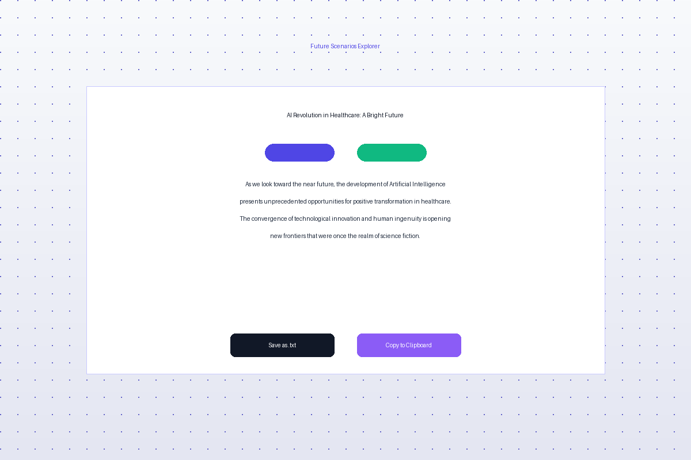

# Future Scenarios Explorer

A modern, interactive web application for exploring potential future scenarios at the intersection of technology, society, and time.



## 📋 Overview

Future Scenarios Explorer allows users to generate narrative explorations of potential futures based on three key variables:
- **Technology**: The technological innovation driving change
- **Consequence**: The area of impact or societal change
- **Timeframe**: The temporal horizon for the scenario

Users can also select a narrative tone (utopian, dystopian, or ambiguous) to explore different perspectives on the same scenario.

## ✨ Features

- **Interactive Scenario Generation**: Create custom scenarios based on user selections
- **Multiple Narrative Tones**: Explore optimistic, pessimistic, or balanced perspectives
- **Responsive Design**: Works seamlessly on desktop and mobile devices
- **Dark/Light Mode**: Automatic theme detection with manual toggle option
- **Export Options**: Download scenarios as text files or copy to clipboard
- **Web Share API Support**: Share scenarios directly from the browser (on supported devices)
- **Sample Scenarios**: Pre-generated examples to showcase the application's capabilities
- **Modern UI**: Built with Vue.js and TailwindCSS for a sleek, futuristic aesthetic
- **Client-side Generation**: No backend dependencies for easy deployment

## 🛠️ Technologies Used

- [Vue.js 3](https://vuejs.org/) - Progressive JavaScript framework
- [TailwindCSS](https://tailwindcss.com/) - Utility-first CSS framework
- [Vite](https://vitejs.dev/) - Next generation frontend tooling
- [@vueuse/motion](https://motion.vueuse.org/) - Vue composables for animations
- [Material Icons](https://fonts.google.com/icons) - Icon library
- [Inter Font](https://rsms.me/inter/) - Modern typeface

## 🚀 Getting Started

### Prerequisites

- Node.js (v14 or later)
- npm or yarn

### Installation

1. Clone the repository
```bash
git clone https://github.com/yourusername/future-scenarios.git
cd future-scenarios
```

2. Install dependencies
```bash
npm install
# or
yarn
```

3. Start the development server
```bash
npm run dev
# or
yarn dev
```

4. Open your browser and navigate to `http://localhost:5173`

## 📦 Building for Production

```bash
npm run build
# or
yarn build
```

The built files will be in the `dist` directory, ready to be deployed to any static hosting service.

## 🚢 Deployment

### Deploying to Vercel

1. Install the Vercel CLI
```bash
npm install -g vercel
```

2. Deploy the project
```bash
vercel
```

3. For production deployment
```bash
vercel --prod
```

### Deploying to Netlify

1. Install the Netlify CLI
```bash
npm install -g netlify-cli
```

2. Deploy the project
```bash
netlify deploy
```

3. For production deployment
```bash
netlify deploy --prod
```

### Deploying to Glitch

1. Create a new project on [Glitch](https://glitch.com/)
2. Import your GitHub repository or upload the files
3. In the project settings, set the "Start Command" to `npm run start` if needed

## 📂 Project Structure

```
future-scenarios/
├── public/                      # Static assets
│   ├── favicon.ico
│   └── images/                  # Static images
├── src/                         # Source code
│   ├── assets/                  # Project assets
│   │   ├── css/                 # Global CSS
│   │   └── data/                # JSON data files for scenarios
│   ├── components/              # Vue components
│   │   ├── ExportOptions.vue    # Scenario export functionality
│   │   ├── ScenarioDisplay.vue  # Displays generated scenarios
│   │   ├── ScenarioForm.vue     # Form for creating scenarios
│   │   └── ScenarioGenerator.vue # Main generator component
│   ├── views/                   # Vue views/pages
│   │   └── HomePage.vue         # Main application page
│   ├── utils/                   # Utility functions
│   │   └── scenarioGenerator.js # Scenario generation logic
│   ├── App.vue                  # Root component
│   └── main.js                  # Entry point
├── .gitignore                   # Git ignore file
├── package.json                 # Project dependencies
├── README.md                    # Project documentation
├── tailwind.config.js           # TailwindCSS configuration
├── postcss.config.js            # PostCSS configuration
└── vite.config.js               # Vite configuration
```

## 🧪 Sample Scenarios

The application includes several pre-generated scenarios to demonstrate its capabilities:

1. **AI Revolution in Healthcare** - An optimistic exploration of how artificial intelligence will transform medical diagnosis and treatment in the near future.

2. **The Dark Side of Brain Interfaces** - A cautionary look at how brain-computer interfaces might affect privacy and security by 2040.

3. **Space Technology and Global Governance** - A balanced perspective on how space commercialization will influence international relations and governance.

4. **Quantum Computing's Impact on Inequality** - An exploration of how quantum computing might affect technological inequality in the distant future.

## 🧩 How It Works

1. **Select Parameters**: Choose a technology, consequence, timeframe, and narrative tone from the form.
2. **Generate Scenario**: The application creates a unique narrative based on your selections using predefined templates and logic.
3. **Review & Share**: Read your generated scenario and use the export options to save or share it.

## 🔍 Browser Compatibility

The application has been tested and works well on:
- Chrome (latest)
- Firefox (latest)
- Safari (latest)
- Edge (latest)

## 📱 Mobile Responsiveness

The application is fully responsive and provides an optimized experience on:
- Desktop computers
- Tablets
- Mobile phones

## 🤝 Contributing

Contributions are welcome! Please feel free to submit a Pull Request.

1. Fork the repository
2. Create your feature branch (`git checkout -b feature/amazing-feature`)
3. Commit your changes (`git commit -m 'Add some amazing feature'`)
4. Push to the branch (`git push origin feature/amazing-feature`)
5. Open a Pull Request

## 📄 License

This project is licensed under the MIT License - see the LICENSE file for details.

## 🙏 Acknowledgments

- Inspired by futures thinking and scenario planning methodologies
- Built with modern web technologies for an optimal user experience
- Special thanks to the Vue.js and TailwindCSS communities for their excellent documentation and tools